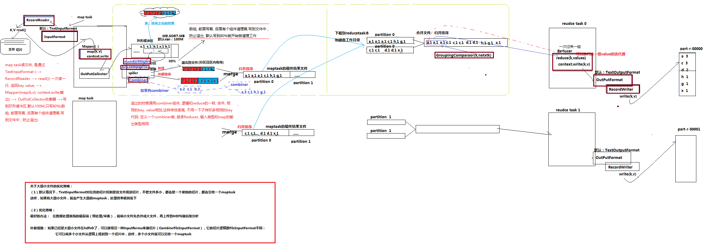

# MapReduce 的Shuffle机制

MapReduce中，map阶段处理的数据如何传递给Reduce阶段，是MapReduce框架中最关键的一个流程，这个流程叫shuffle；其核心机制：数据分区，排序，缓存；具体来讲，将mapTask 输出的处理结果数据，分发给ReduceTask，并在分发过程中，对数据按照key进行了分区和排序。

## MapReduce原理全剖析

### shuffle 主要流程

shuffle的每一个处理步骤是分散在各个mapTask和reduceTask节点上完成的，整体分为3个操作：分区Partition；Sort 根据key进行排序，Combiner进行局部Value的合并

1. mapTask收集map()方法输出的KV对，放到内存缓冲区
2. 从内存缓冲区中不断溢出到本地磁盘文件（Spiller 组件负责，环形缓冲区默认100M，超过80%空间时进行调用），可能溢出多个文件
3. 多个溢出文件被合并成大的溢出文件(merge)
4. 在溢出过程和合并过程中，都要调用针对key的partitioner进行分区（HashPartitioner组件，根据key的哈希进行分区）和进行排序（溢出的时候默认使用快排 key.compareTo,merge的时候使用归并排序），结果文件分区且有序。
5. reduceTask根据自己的分区号，去各个mapTask机器上下载相应的结果分区数据
6. reduceTask会取到同一个分区的来自不同mapTask的结果文件，reduceTask会将这些文件进行合并（归并排序）
7. 合并成大文件后，shuffle的过程也就结束了，后面进入reduceTask的逻辑运算过程（从文件中取出一个个的键值对使用groupingComparator组件进行判断，调用用户定义的reduce()方法）

**关于Combiner组件：** 溢出的时候调用Combiner组件，逻辑和Reduce的一样，合并，相同的key，value相加，这样效率高，不用一下子传递很多相同key。

