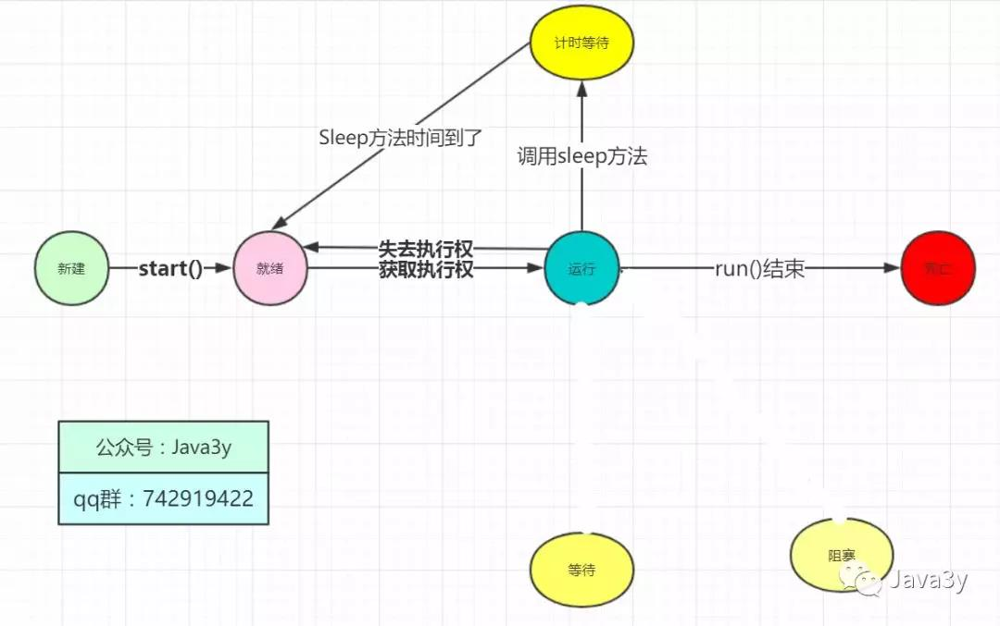

# Thread 源码剖析
## 守护线程
守护线程是为其他线程服务的

垃圾回收线程就是守护线程~
守护线程有一个特点：

当别的用户线程执行完了，虚拟机就会退出，守护线程也就会被停止掉了。
也就是说：守护线程作为一个服务线程，没有服务对象就没有必要继续运行了
使用线程的时候要注意的地方

在线程启动前设置为守护线程，方法是setDaemon(boolean on)
使用守护线程不要访问共享资源(数据库、文件等)，因为它可能会在任何时候就挂掉了。
守护线程中产生的新线程也是守护线程  

```Java
public class MyThreadDemo {
    public static void main(String[] args) {


        MyThread myThread = new MyThread();

        //带参构造方法给线程起名字
        Thread thread1 = new Thread(myThread, "关注公众号Java3y");
        Thread thread2 = new Thread(myThread, "qq群：742919422");

        // 设置为守护线程
        thread2.setDaemon(true);

        thread1.start();
        thread2.start();
        System.out.println(Thread.currentThread().getName());
    }
}
```
上面的代码运行多次可以出现(电脑性能足够好的同学可能测试不出来)：线程1和主线程执行完了，我们的守护线程就不执行了~   

原理：这也就为什么我们要在启动之前设置守护线程了。  


## 优先级线程
线程优先级高仅仅表示线程获取的CPU时间片的几率高，但这不是一个确定的因素！

线程的优先级是高度依赖于操作系统的，Windows和Linux就有所区别(Linux下优先级可能就被忽略了)~

可以看到的是，Java提供的优先级默认是5，最低是1，最高是10：     


## 线程的生命周期
在Java中我们就有了这个图，Thread上很多的方法都是用来切换线程的状态的，这一部分是重点！


### sleep 方法
调用sleep方法会进入计时等待状态，等时间到了，进入的是就绪状态而并非是运行状态！      



### yield 方法
调用yield方法会先让别的线程执行，但是不确保真正让出

意思是：我有空，可以的话，让你们先执行    


于是乎，我们的图就可以补充成这样：    


### join 方法
调用join方法，会等待该线程执行完毕后才执行别的线程~   

   
wait方法是在Object上定义的，它是native本地方法，所以就看不了了：   
wait方法实际上它也是计时等待(如果带时间参数)的一种！，于是我们可以补充我们的图：   

### interrupt 方法
线程中断在之前的版本有stop方法，但是被设置过时了。现在已经没有强制线程终止的方法了！

由于stop方法可以让一个线程A终止掉另一个线程B
- 被终止的线程B会立即释放锁，这可能会让对象处于不一致的状态。
- 线程A也不知道线程B什么时候能够被终止掉，万一线程B还处理运行计算阶段，线程A调用stop方法将线程B终止，那就很无辜了~
总而言之，Stop方法太暴力了，不安全，所以被设置过时了。

我们一般使用的是interrupt来请求终止线程~
- interrupt不会真正停止一个线程，它仅仅是给这个线程发了一个信号告诉它，它应该结束了
- Java的设计者实际上想线程自己来终止，通过上面的信号，就可以判断处理什么业务了。   
- 具体到底中断还是继续执行，应该由被通知的线程自己来处理    
```Java
 Thread t1 = new Thread( new Runnable(){
    public void run(){
        // 若未发生中断，就正常执行任务
        while(!Thread.currentThread.isInterrupted()){
            // 正常任务代码……
        }
        // 中断的处理代码……
        doSomething();
    }
} ).start();
```
再次说明，调用interrupt() 并不是要真正地终止掉当前线程，仅仅是设置了一个中断标志。这个中断标志可以给我们用来判断什么时候该干什么工作，什么时候中断由我们自己来决定，这样可以安全地终止线程了。   
源码如下：     

再来看看刚才说抛出的异常是什么东东吧：     


所以说：interrupt方法压根是不会对线程的状态造成影响的，它仅仅设置一个标志位罢了

interrupt线程中断还有另外两个方法(检查该线程是否被中断)：   

静态方法interrupted()-->会清除中断标志位
实例方法isInterrupted()-->不会清除中断标志位    


上面还提到了，如果阻塞线程调用了interrupt()方法，那么会抛出异常，设置标志位为false，同时该线程会退出阻塞的。我们来测试一波：

```Java
public class Main {
    /**
     * @param args
     */
    public static void main(String[] args) {
        Main main = new Main();

        // 创建线程并启动
        Thread t = new Thread(main.runnable);
        System.out.println("This is main ");
        t.start();

        try {

            // 在 main线程睡个3秒钟
            Thread.sleep(3000);
        } catch (InterruptedException e) {
            System.out.println("In main");
            e.printStackTrace();
        }

        // 设置中断
        t.interrupt();
    }

    Runnable runnable = () -> {
        int i = 0;
        try {
            while (i < 1000) {

                // 睡个半秒钟我们再执行
                Thread.sleep(500);

                System.out.println(i++);
            }
        } catch (InterruptedException e) {


            // 判断该阻塞线程是否还在
            System.out.println(Thread.currentThread().isAlive());

            // 判断该线程的中断标志位状态
            System.out.println(Thread.currentThread().isInterrupted());

            System.out.println("In Runnable");
            e.printStackTrace();
        }
    };
}
```

执行流程  


[参考博客](https://mp.weixin.qq.com/s/QL1wR_q5IZHufaYz60KsnQ)   
作者： Java3y