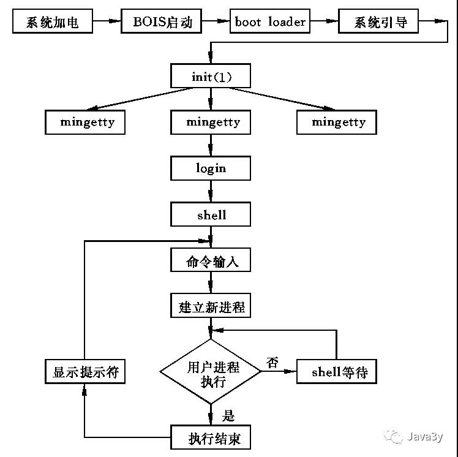
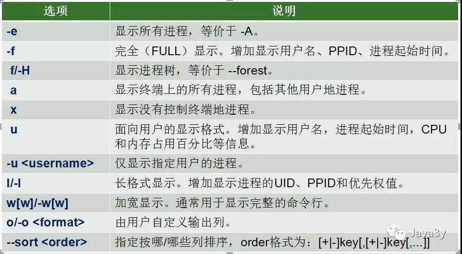
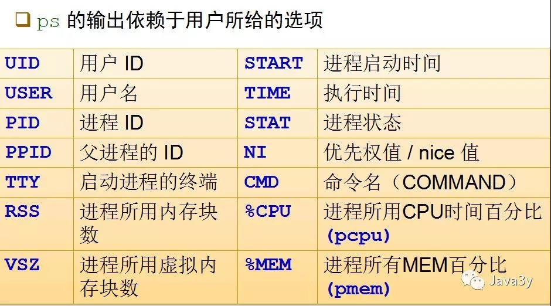
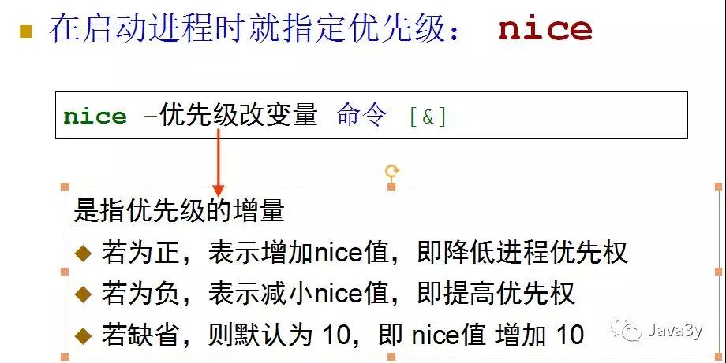
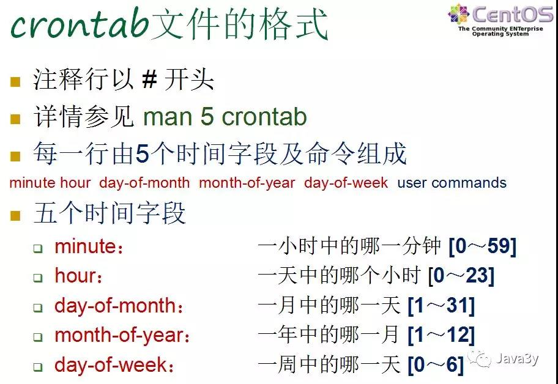

# Linux 进程管理

## 1. Linux 下的进程
每个用户均可同时运行多个程序。为了区分每一个运行的程序，Linux给每个进程都做了标识，称为进程号（process ID），每个进程的进程号是唯一的。

Linux 给每个进程都打上了运行者的标志，用户可以控制自己的进程：给自己的进程分配不同的优先级，也可以随时终止自己的进程。   
- 进程从执行它的用户继承UID、GID，从而决定对文件系统的存取和访问   

**使用PID区分不同的进程**   
-  系统启动后的第一个进程是init，它的PID是1。init是唯一一个由系统内核直接运行的进程。  
-  除了init之外，每个进程都有父进程（PPID标识）  
-  每个进程还有四个与用户和组相关的识别号     
实际用户识别号   （real user ID，RUID）   
实际组识别号        （real group ID，RGID）   
有效用户识别号   （effect user ID，EUID）   
有效组识别号        （effect group ID，EGID）   
RUID和RGID的作用：识别正在运行此进程的用户和组。   
EUID和EGID的作用：确定一个进程对其访问的文件的权限。    

**进程类型：**    
 1. 交互进程    
 - 由shell启动的进程   
 - 交互进程既可以在前台运行，也可以在后台运行    
 2. 批处理进程    
 - 不与特定的终端相关联，提交到等待队列中顺序执行的进程   
 3. 守护进程
 - 在Linux启动的时候进行初始化，需要时运行后台的进程   
 

**进程的启动方式：**

手工方式：使用操作系统提供的用户接口    
前台   
后台 （&）   
调度方式：按照预先指定的时间执行    
at    
batch    
cron   

**进程和作业的区别**   
1. 进程：操作系统的概念，由操作系统负责管理   
2. 作业：shell程序的概念，由shell程序负责管理    
- 一个操作系统可用启动多个shell程序，shell本身也是一种进程   
- 一个作业里面至少包含一个进程，也可以包含多个进程   
- 作业分前台和后台之分   

**流程图**     

## 1.1 管理进程常用命令  

    

**还有其他几个常用命令：**     

注销后继续运行进程：nohup 命令 [选项] [参数] [输出文件] &    
杀死进程：kill pid  -9    
free：查看内存使用状况    
top ：查看实时刷新的系统进程信息    
进程调度的优先权nice命令：    
进程运行后调整优先级：renice命令。    

启动进程时指定优先级：nice    
    

作业控制是指控制当前正在运行的进程的行为，也被称为进程控制。    

暂时停止某个运行程序 使用Ctrl+z   
列举作业号码和名称：jobs   
在后台恢复运行：bg [%作业号码]   
在前台恢复运行：fg [%作业号码]   
发送信号：kill -[信号] pid    

## 2.自动化任务
调度任务的守护进程：   

atd   
crond    
安排调度任务的几个命令：    

at    安排作业在某一时刻执行一次    
batch    安排作业在系统负载不重时执行一次    
cron    安排周期性运行的作业     

### 2.1 atd 守护进程   

atd守护进程负责监控一次性任务的执行，atd守护进程的执行参数/etc/sysconfig/atd    

控制普通用户的使用    

若/etc/at.allow存在，仅列在其中的用户允许使用    
若/etc/at.allow 不存在，检查/etc/at.deny，没有列于其中的所有用户允许使用    
若两个文件均不存在，仅允许root用户使用     
空的/etc/at.deny文件，表示允许所有用户使用（默认值）     
如何使用：     

安装命令yum install at     
atd的启动service atd start    
atd服务的查看chkconfig --list | grep atd或者ps -aef | grep atd     
at 命令格式及参数  at [-q 队列] [-f 文件名] 时间     

### 2.2 crond   

crond守护进程负责监控周期性任务的执行    
crond守护进程的执行参数配置文件/etc/sysconfig/crond     
控制普通用户的使用     
 
若/etc/cron.allow存在，仅列在其中的用户允许使用     
若/etc/cron.allow 不存在，检查/etc/cron.deny，没有列于其中的所有用户允许使用    
若两个文件均不存在，仅允许root用户使用    
空的/etc/cron.deny文件，表示允许所有用户使用（默认值）   
crond启动以后，每分钟唤醒一次，检测如下文件的变化并将其加载到内存    

/etc/crontab：是crontab格式（man 5 crontab）的文件    
/etc/cron.d/*：是crontab格式（man 5 crontab）的文件    
/var/spool/cron/*：是crontab格式（man 5 crontab）的文件    
/etc/anacrontab：是anacrontab格式（man 5 anacrontab）的文件    

[参考博客：](https://mp.weixin.qq.com/s/8PevSxn2fmiKBJbb9M39xw) https://mp.weixin.qq.com/s/8PevSxn2fmiKBJbb9M39xw   
作者：Java3y
 

