# 深入浅出Redis底层数据结构
## 1. 概述
Redis 数据库里面的每个键值对（key-value） 都是由对象（object）组成的：

数据库键总是一个字符串对象（string object）;

数据库的值则可以是字符串对象、列表对象（list）、哈希对象（hash）、集合对象（set）、有序集合（sort set）对象这五种对象中的其中一种。

我们为什么会说Redis 优于Memcached 呢，因为Redis 的出现，丰富了memcached 中key-value的存储不足，在部分场合可以对关系数据库起到很好的补充作用，而且这些数据类型都支持push/pop、add/remove及取交集并集和差集及更丰富的操作，而且这些操作都是原子性的。 

Redis底层数据类型：   
1. 简单动态字符串  
2. 链表   
3. 字典   
4. 跳跃表  
5. 整数集合   
6. 压缩列表   
7. 对象   

## 2. 简单动态字符串（simple dynamic string） SDS
### 2.1 概述

　Redis 是一个开源的使用ANSI C语言编写的key-value 数据库，我们可能会较为主观的认为 Redis 中的字符串就是采用了C语言中的传统字符串表示，但其实不然，Redis 没有直接使用C语言传统的字符串表示，而是自己构建了一种名为简单动态字符串（simple dynamic string SDS）的抽象类型，并将SDS用作Redis 的默认字符串表示：   
　设置一个key= msg，value = hello world 的新键值对，他们底层是数据结构将会是：

　键（key）是一个字符串对象，对象的底层实现是一个保存着字符串“msg” 的SDS；

　值（value）也是一个字符串对象，对象的底层实现是一个保存着字符串“hello world” 的SDS

从上述例子，我们可以很直观的看到我们在平常使用redis 的时候，创建的字符串到底是一个什么样子的数据类型。除了用来保存字符串以外，SDS还被用作缓冲区（buffer）AOF模块中的AOF缓冲区。   
### 2.2 SDS 定义 
```C
/*  
 * 保存字符串对象的结构  
 */  
struct sdshdr {  
      
    // buf 中已占用空间的长度  
    int len;  
  
    // buf 中剩余可用空间的长度  
    int free;  
  
    // 数据空间  
    char buf[];  
};  
```  
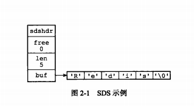   
　1、len 变量，用于记录buf 中已经使用的空间长度（这里指出Redis 的长度为5）

　2、free 变量，用于记录buf 中还空余的空间（初次分配空间，一般没有空余，在对字符串修改的时候，会有剩余空间出现）

　3、buf 字符数组，用于记录我们的字符串（记录Redis）

###  2.3 SDS 与 C字符串的区别
传统的C 字符串 使用长度为N+1 的字符串数组来表示长度为N 的字符串，这样做在获取字符串长度，字符串扩展等操作的时候效率低下。C 语言使用这种简单的字符串表示方式，并不能满足Redis 对字符串在安全性、效率以及功能方面的要求   

#### 2.3.1 获取字符串长度（SDS O(1) / C 字符串 O(n)） 

传统的C 字符串 使用长度为N+1 的字符串数组来表示长度为N 的字符串，所以为了获取一个长度为C字符串的长度，必须遍历整个字符串。   
和C 字符串不同，SDS 的数据结构中，有专门用于保存字符串长度的变量，我们可以通过获取len 属性的值，直接知道字符串长度。   
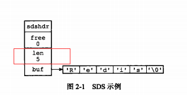   

#### 2.3.2 杜绝缓冲区溢出  
C 字符串 不记录字符串长度，除了获取的时候复杂度高以外，还容易导致缓冲区溢出。

 假设程序中有两个在内存中紧邻着的 字符串 s1 和 s2，其中s1 保存了字符串“redis”，二s2 则保存了字符串“MongoDb”：   
 
 如果我们现在将s1 的内容修改为redis cluster，但是又忘了重新为s1 分配足够的空间，这时候就会出现以下问题：   
  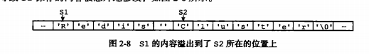
我们可以看到，原本s2 中的内容已经被S1的内容给占领了，s2 现在为 cluster，而不是“Mongodb”。  

Redis 中SDS 的空间分配策略完全杜绝了发生缓冲区溢出的可能性：  
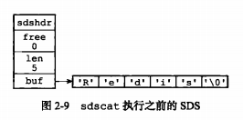
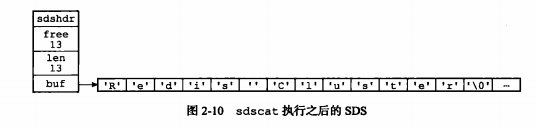

#### 2.3.3 减少修改字符串带来的内存重新分配次数

C语言字符串在进行字符串的扩充和收缩的时候，都会面临着内存空间的重新分配问题。

1. 字符串拼接会产生字符串的内存空间的扩充，在拼接的过程中，原来的字符串的大小很可能小于拼接后的字符串的大小，那么这样的话，就会导致一旦忘记申请分配空间，就会导致内存的溢出。

2. 字符串在进行收缩的时候，内存空间会相应的收缩，而如果在进行字符串的切割的时候，没有对内存的空间进行一个重新分配，那么这部分多出来的空间就成为了内存泄露。

举个例子：我们需要对下面的SDS进行拓展，则需要进行空间的拓展，这时候redis 会将SDS的长度修改为13字节，并且将未使用空间同样修改为1字节 

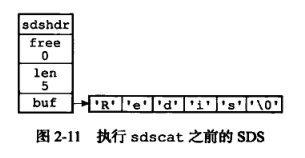
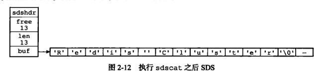

因为在上一次修改字符串的时候已经拓展了空间，再次进行修改字符串的时候会发现空间足够使用，因此无须进行空间拓展   

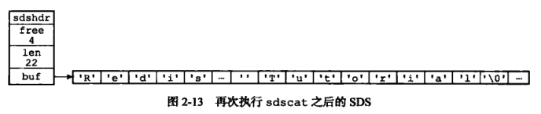

#### 2.3.4 惰性释放
　我们在观察SDS 的结构的时候可以看到里面的free 属性，是用于记录空余空间的。我们除了在拓展字符串的时候会使用到free 来进行记录空余空间以外，在对字符串进行收缩的时候，我们也可以使用free 属性来进行记录剩余空间，这样做的好处就是避免下次对字符串进行再次修改的时候，需要对字符串的空间进行拓展。

然而，我们并不是说不能释放SDS 中空余的空间，SDS 提供了相应的API，让我们可以在有需要的时候，自行释放SDS 的空余空间。

通过惰性空间释放，SDS 避免了缩短字符串时所需的内存重分配操作，并未将来可能有的增长操作提供了优化

#### 2.3.5 二进制安全
 C 字符串中的字符必须符合某种编码，并且除了字符串的末尾之外，字符串里面不能包含空字符，否则最先被程序读入的空字符将被误认为是字符串结尾，这些限制使得C字符串只能保存文本数据，而不能保存想图片，音频，视频，压缩文件这样的二进制数据。

但是在Redis中，不是靠空字符来判断字符串的结束的，而是通过len这个属性。那么，即便是中间出现了空字符对于SDS来说，读取该字符仍然是可以的。


#### 2.3.6 总结

|                  C 字符串                  |                  SDS                   |
|--------------------------------------------|----------------------------------------|
| 获取字符串的复杂度为O(n)                   | 获取字符串长度的复杂度为O(1)             |
| API 是不安全的，可能会造成缓冲区溢出        | API 是安全的，不会造成缓冲区溢出       |
| 修改字符串长度N次必然需要执行N次内存重分配 | 修改字符串长度N次最多执行N次内存重分配 |
| 只能保存文本数据                           | 可以保存二进制数据和文本文数据         |
| 可以使用所有<String.h>库中的函数           | 可以使用一部分<string.h>库中的函数     |

## 3. 链表
### 3.1 概述
链表提供了高效的节点重排能力，以及顺序性的节点访问方式，并且可以通过增删节点来灵活地调整链表的长度。

链表在Redis 中的应用非常广泛，比如列表键的底层实现之一就是链表。当一个列表键包含了数量较多的元素，又或者列表中包含的元素都是比较长的字符串时，Redis 就会使用链表作为列表键的底层实现。

### 3.2 链表的数据结构
```C
typedef struct listNode{
      struct listNode *prev;
      struct listNode * next;
      void * value;  
}
```   
多个链表节点组成的双端链表

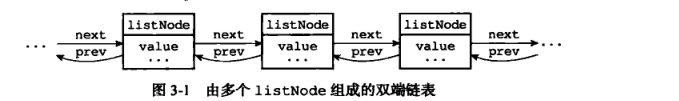

```C
typedef struct list{
    //表头节点
    listNode  * head;
    //表尾节点
    listNode  * tail;
    //链表长度
    unsigned long len;
    //节点值复制函数
    void *(*dup) (void *ptr);
    //节点值释放函数
    void (*free) (void *ptr);
    //节点值对比函数
    int (*match)(void *ptr, void *key);
}
```  

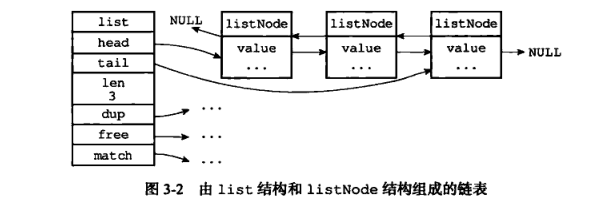    
### 3.3 链表的特性
双端：链表节点带有prev 和next    指针，获取某个节点的前置节点和后置节点的时间复杂度都是O（N）   
无环：表头节点的 prev 指针和表尾节点的next 都指向NULL，对立案表的访问时以NULL为截止    
表头和表尾：因为链表带有head指针和tail     指针，程序获取链表头结点和尾节点的时间复杂度为O(1)    
长度计数器：链表中存有记录链表长度的属性 len    
多态：链表节点使用 void* 指针来保存节点值，并且可以通过list 结构的dup 、 free、match三个属性为节点值设置类型特定函数

## 4. 字典
### 4.2 字典的定义
#### 4.2.1 哈希表
```C
typedef struct dictht {
   //哈希表数组
   dictEntry **table;
   //哈希表大小
   unsigned long size;

   //哈希表大小掩码，用于计算索引值
   unsigned long sizemask;
   //该哈希表已有节点的数量
   unsigned long used;
}
```  
一个空的字典如下：  
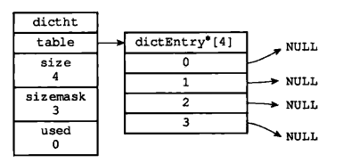  
我们可以看到，在结构中存有指向dictEntry 数组的指针，而我们用来存储数据的空间既是dictEntry   

#### 4.2.2 哈希表节点（dictEntry）
```C
typeof struct dictEntry{
   //键
   void *key;
   //值
   union{
      void *val;
      uint64_tu64;
      int64_ts64;
   }
   struct dictEntry *next;

}
```  
在数据结构中，我们清楚key 是唯一的，但是我们存入里面的key 并不是直接的字符串，而是一个hash 值，通过hash 算法，将字符串转换成对应的hash 值，然后在dictEntry 中找到对应的位置。

这时候我们会发现一个问题，如果出现hash 值相同的情况怎么办？Redis 采用了链地址法：

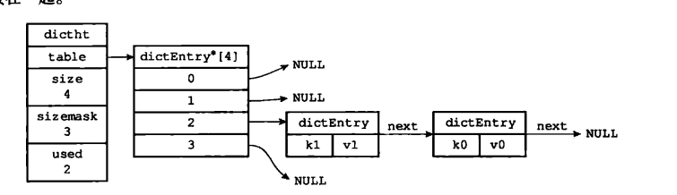
当k1 和k0 的hash 值相同时，将k1中的next 指向k0 想成一个链表。   

```C
typedef struct dict {
    // 类型特定函数
    dictType *type;
    // 私有数据
    void *privedata;
    // 哈希表
    dictht  ht[2];
    // rehash 索引
    in trehashidx;

}
```
type 属性 和privdata 属性是针对不同类型的键值对，为创建多态字典而设置的。   
ht 属性是一个包含两个项（两个哈希表）的数组    
普通状态下的字典：   
  

### 4.3 解决哈希冲突 
在上述分析哈希节点的时候我们有讲到：在插入一条新的数据时，会进行哈希值的计算，如果出现了hash值相同的情况，Redis 中采用了连地址法（separate chaining）来解决键冲突。每个哈希表节点都有一个next 指针，多个哈希表节点可以使用next 构成一个单向链表，被分配到同一个索引上的多个节点可以使用这个单向链表连接起来解决hash值冲突的问题。   
例子：      
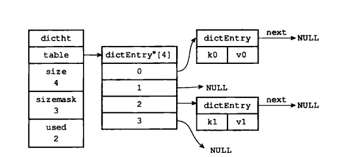    
我们现在要插入k2，通过hash 算法计算到k2 的hash 值为2，即我们需要将k2 插入到dictEntry[2]中：     
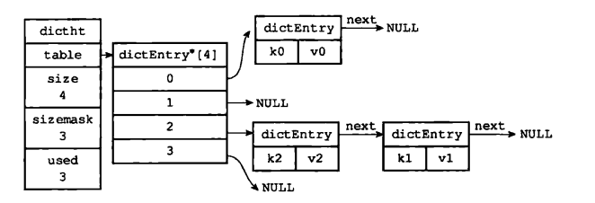   

### 4.4 Rehash
随着对哈希表的不断操作，哈希表保存的键值对会逐渐的发生改变，为了让哈希表的负载因子维持在一个合理的范围之内，我们需要对哈希表的大小进行相应的扩展或者压缩，这时候，我们可以通过 rehash（重新散列）操作来完成。     
#### 4.4.1 目前的Hash状态
我们可以看到，哈希表中的每个节点都已经使用到了，这时候我们需要对哈希表进行拓展。  

   

#### 4.4.2 为hash表分配空间   
哈希表空间分配规则：

如果执行的是拓展操作，那么ht[1] 的大小为第一个大于等于ht[0] 的2的n次幂

如果执行的是收缩操作，那么ht[1] 的大小为第一个小于等于ht[0] 的2的n次幂

因此这里我们为ht[1] 分配 空间为8，   


#### 4.4.3 数据转移
将ht[0]中的数据转移到ht[1]中，在转移的过程中，需要对哈希表节点的数据重新进行哈希值计算
数据转移后的结果：   

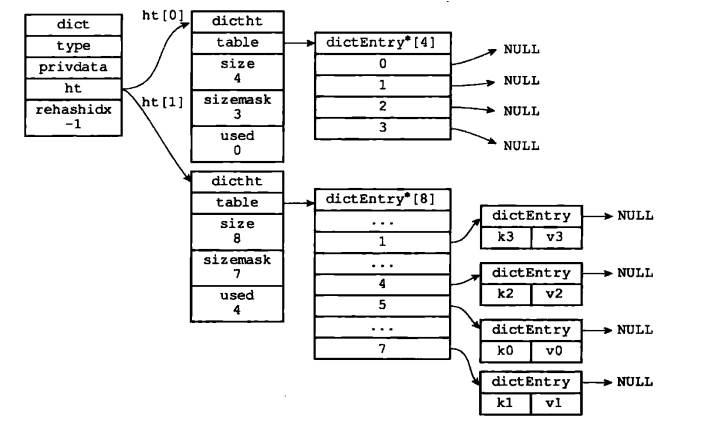  

#### 4.4.4 释放ht[0]  

将ht[0]释放，然后将ht[1]设置成ht[0]，最后为ht[1]分配一个空白哈希表：  
   

#### 4.4.5 渐进式rehash 
上面我们说到，在进行拓展或者压缩的时候，可以直接将所有的键值对rehash 到ht[1]中，这是因为数据量比较小。在实际开发过程中，这个rehash 操作并不是一次性、集中式完成的，而是分多次、渐进式地完成的。   
1. 为ht[1] 分配空间，让字典同时持有ht[0] 和 ht[1] 两个hash表   
2. 在几点钟维持一个索引计数器变量rehashidx，并将它的值设置为0，表示rehash开始    
3. 在rehash进行期间，每次对字典执行CURD操作时，程序除了执行制定操作以外，还会降ht[0]中的数据rehash 到 ht[1]表中，并且将rehashidx加一  
4. 当ht[0] 中所有数据迁移到ht[1] 中时，将rehashidx 设置为 1 ，表示rehash结束    

采用渐进式的rehash的好处在于分而治之，避免了集中式rehash带来的庞大计算   

## 5. 跳跃表  
### 5.1 概述
跳跃表是一种有序的数据结构，它通过在每个节点中维持着多个指向其他节点的指针，从而达到快速访问节点的目的。跳跃表是一种随机化的数据，跳跃表是以有序的方式在层次化的链表中保存元素，效率和平衡树媲美，查找、删除、添加操作都可以在对数期望时间下完成，并且比起平衡树来说，跳跃表的实现要简单直观的多    
Redis中在两个地方使用到了跳跃表，一个是实现有序集合键，另外一个是在集群节点中用作内部数据结构。    
### 5.2 跳跃表的定义
完整的跳跃表结构  
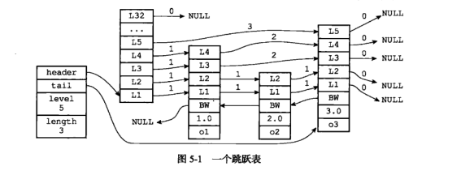   
Redis的跳跃表主要由两部分组成： zskiplist(链表) 和 zskiplistNode(节点)   

### 5.2.1 zskiplistNode 节点数据结构
```C
typedef struct zskiplistNode{
　　　//层
     struct zskiplistLevel{
　　　　　//前进指针
        struct zskiplistNode *forward;
　　　　//跨度
        unsigned int span;
    } level[];
　　//后退指针
    struct zskiplistNode *backward;
　　//分值
    double score;
　　//成员对象
    robj *obj;
}
```
1. 层： level数组可以包含多个元素，每个元素都包含一个指向其他节点的指针。  
2. 前进指针： 用于指向表尾方向的前进指针   
3. 跨度： 用于记录两个节点之间的距离
4. 后退指针： 用于从表尾向表头方向的访问节点
5. 分值和成员：跳跃表中的所有节点都是按照分值从小到大进行排序的，成员对象指向一个字符串，这个字符串保存着一个SDS值   

#### 5.2.2 zskiplist 数据结构
```C
typedef struct zskiplist {
     //表头节点和表尾节点
     structz skiplistNode *header,*tail;
     //表中节点数量
     unsigned long length;
     //表中层数最大的节点的层数
     int level;

}zskiplist;

```   
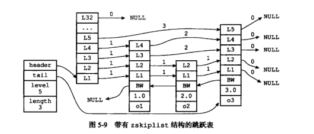   

从结构图中看到，header，tail 分别指向跳跃表的头节点和尾节点。level用于记录最大的层数，length用于记录我们的节点的数量   

### 5.3总结
1. 跳跃表示有序集合的底层实现之一 
2. 主要由zskiplist 和  zskiplistNode 两个结构组成    
3. 每个跳跃表节点的层高都是1 至 32 之间的随机数  
4. 在同一个跳跃表中，多个节点可以包含相同的分值，但是每个节点的对象必须是统一的   
5. 节点按照分值的大小从大到小排序，如果分值相同，则按照成员对象的大小排序   

## 6. 整数集合（Intset） 
### 6.1 概述
整数集合是集合键的底层实现之一，当一个集合中只包含整数，并且这个集合中的元素数量不多时，redis就会使用整数集合intset作为集合底层实现。  
### 6.2 整数集合的实现  
```C
typedef struct intset{
    //编码方式
    uint32_t enconding;
   // 集合包含的元素数量
    uint32_t length;
    //保存元素的数组    
    int8_t contents[];

}  
```
我们来观察一下一个完成的整数集合结构图  
 

encoding: 用于定义整数集合的编码方式    
length： 用于记录整数集合中变量的数量    
contents: 用于保存元素的数组，虽然我们在数据构图中看到，intset将数组定义为int8_t，但实际上数组保存的元素类型取决于encoding    
### 6.3 整数集合的升级   
上述数据结构图中我们可以看到，intset 在默认情况下会帮我们设定整数集合中的编码方式，但是当我们存入的整数不符合整数集合中的编码格式时，就需要使用到Redis 中的升级策略来解决Intset中升级整数元素集合并添加新元素共分为三步进行：   
1. 根据新元素的类型，扩展整数集合底层数组的空间大小，并为新元素分配空间   
2. 将底层数组现有的所有元素都转换成新的编码格式，重新分配空间   
3. 将新元素加入到底层数组中   

例子：    
我们需要插入一个32位的整数，这显然和整数集合不符合，我们将进行编码格式的转换，并为新元素分配空间：   


第二步，将原有数据他们的数据类型转换为与新数据相同的类型：（重新分配空间后的数据） 

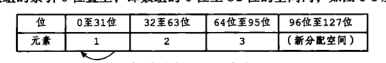

第三部，将新数据添加到数组中：    
   

#### 6.3.1 整数集合升级的好处  
1. 提升灵活性 
2. 节约内存  

### 6.4 总结
1. 整数集合是集合键的底层实现之一    
2. 整数集合的底层实现为数组，这个数组以有序、无重复的范式保存集合元素，在有需要的时候，程序会根据新添加的元素类型改变这个数组的类型   
3. 升级操作为整数集合带来了操作上的灵活性，并且尽可能的节约了内存
4. 整数集合只支持升级操作，不支持降级操作    

## 压缩列表
### 7.1 概述
压缩列表是列表键和哈希键的底层实现之一。当一个列表键只把很少量的列表项，并且每个列表项要么是小整数，要么就是小整数，要么就是长度比较短的字符串，那么Redis就会使用压缩列表来做列表键的底层实现    

### 7.2 压缩列表的构成 


### 7.3 总结
1. 压缩列表是一种为了节省内存而开发的顺序型数据结构   
2. 压缩列表被用作列表键和哈希键的底层实现之一   
3. 压缩列表可以包含多个节点，每个节点可以保存一个字节数组或者整数
4. 添加新节点到压缩列表，可能会引发连锁更新操作  


1. zlbytes: 用于记录整个压缩列表占用的内存字节数   
2. ztail: 记录要列表尾节点距离压缩列表的起始地址有多少字节
3. zlen： 记录了压缩列表包含的节点数量  
4. entryX：压缩列电包含的各个节点  
5. zlend: 用于标记压缩列表的端末   

  


[参考博客](https://www.cnblogs.com/jaycekon/p/6277653.html)      
作者： jaycekong


  
    
 


