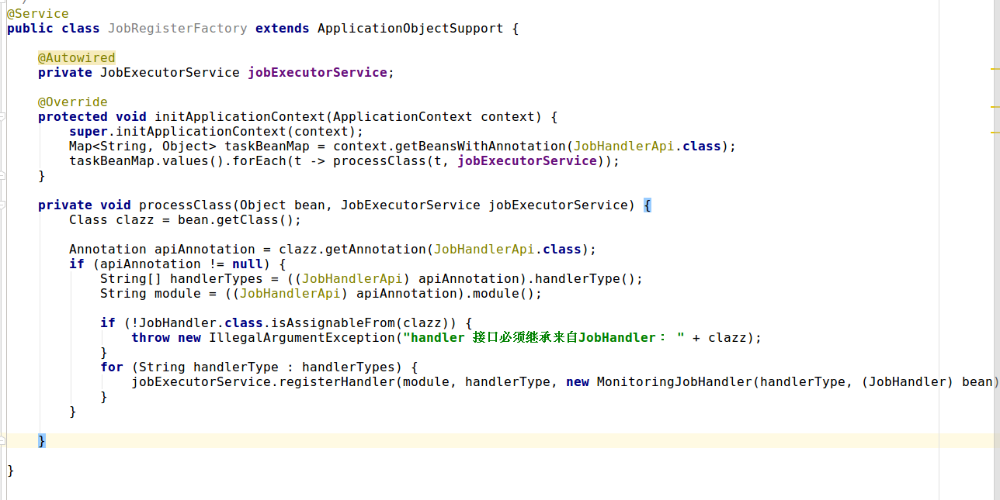

# Spring 自定义注解的使用

### 注解

```Java
@Target({ ElementType.TYPE })//注解用在接口上
@Retention(RetentionPolicy.RUNTIME)//VM将在运行期也保留注释，因此可以通过反射机制读取注解的信息
@Component
public @interface RpcService {
	String value();
}
```

### Service Interface

```Java
public interface HelloService{
    String hello(String name);
}
```

### Service Implement

```Java
@RpcService("HelloServicebb")
public class HelloServiceImpl implements HelloService {
    public String hello(String name) {
        return "Hello! " + name;
    }
    
    public void test(){
    	System.out.println("test");
    }
}
```

### 注解使用方法一

1. 运行main方法的时候，会加载Spring环境
2. Spring2.xml 中进行了注解扫描
3. 此类带有Component注解，会实例化一个bean
4. 调用setApplicationContext 方法
5. 获取自定义注解的内容
6. 反射调用

```Java
@Component        //ApplicationContextAware会为Component组件调用setApplicationContext方法；  测试Myserver3时注释
public class MyServer implements ApplicationContextAware {
	@SuppressWarnings("resource")
	public static void main(String[] args) {
		ClassPathXmlApplicationContext ctx = new ClassPathXmlApplicationContext("spring2.xml");
	}


	public void setApplicationContext(ApplicationContext ctx)
			throws BeansException {
		Map<String, Object> serviceBeanMap = ctx
				.getBeansWithAnnotation(RpcService.class);
		for (Object serviceBean : serviceBeanMap.values()) {
			try {
				//获取自定义注解上的value
				String value = serviceBean.getClass().getAnnotation(RpcService.class).value();
				System.out.println("注解上的value: " + value);
				
				//反射被注解类，并调用指定方法
				Method method = serviceBean.getClass().getMethod("hello",
						new Class[] { String.class });
				Object invoke = method.invoke(serviceBean, "bbb");
				System.out.println(invoke);
			} catch (Exception e) {
				e.printStackTrace();
			}
		}
	}

}

```

### 注解使用方法二


```Java
@RunWith(SpringJUnit4ClassRunner.class)
@ContextConfiguration(locations = "classpath:spring2.xml")
@Component
public class MyServer3 {
	@Autowired
	HelloService helloService;

	@Test
	public void helloTest1() {
		System.out.println("开始junit测试……");
		String hello = helloService.hello("ooooooo");
		System.out.println(hello);
	}

}

```

## 实习的时候遇到的另一个例子

遗留问题：ApplicationContextAware 和  ApplicationObjectSupport


