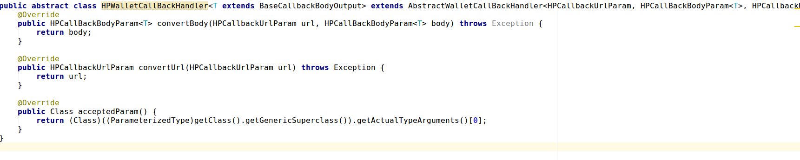
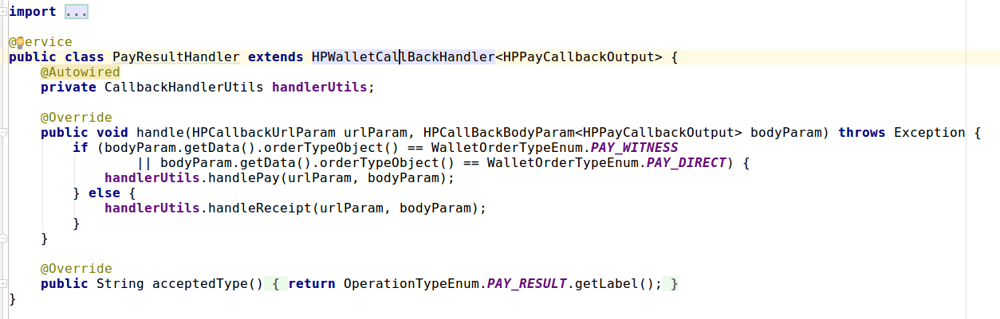
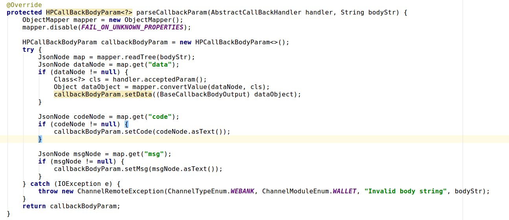

获取泛型参数的实际类型


```java
public Class acceptedParam(){
    public Class acceptedParam() {
        return (Class)((ParameterizedType)getClass().getGenericSuperclass()).getActualTypeArguments()[0];
    } 
}//获取此类的父类的第一个泛型参数的实际类型
```

对应于实际的类型PayResultHandler，其父类HPWallletCallBackHandler， 上述方法返回BaseCallbackBodyOutput的实际子类HPPayCallbackOutput





获取到实际的泛型参数对象，进行反序列化



```java
Class<?> cls = handler.acceptedParam();
                Object dataObject = mapper.convertValue(dataNode, cls);
                callbackBodyParam.setData((BaseCallbackBodyOutput) dataObject);
```

